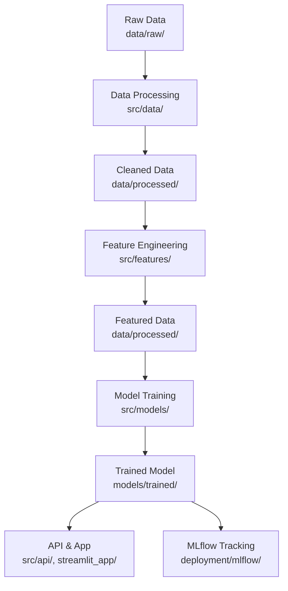

# Configuración del proyecto

## Instalar Conda

### Ver entornos disponibles

```bash
conda env list
# o
conda info --envs
```

### Crear un nuevo entorno

```bash
# Crear entorno con Python y librerías específicas
conda create -n house-predictor python=3.9 pandas numpy matplotlib seaborn scikit-learn jupyter

# Crear entorno básico
conda create -n mi_entorno python=3.9
```

### Activar entorno

```bash
conda activate nombre_del_entorno
# Ejemplo:
conda activate mlops-fisi
```

### Verificar entorno activo

Una vez activado, verás el nombre del entorno en el prompt:

```bash
(mlops-fisi) usuario@mac:~$
```

## Desactivar entorno

```bash
conda deactivate
```

## Instalar paquetes en el entorno

```bash
# Con conda activado
conda install pandas numpy matplotlib

# O con pip
pip install pandas numpy matplotlib
```

## Listar paquetes instalados

```bash
conda list
```

## Eliminar entorno

```bash
conda env remove -n nombre_del_entorno
```

## Configuración del proyecto

### Clonar proyecto

```bash
git clone https://github.com/wils0n/mlops-lab.git
```

### Ingresar al directorio del proyecto

```bash
cd mlops-lab
```

### Crear y activar entorno virtual con conda

```bash
conda create -n mlops-fisi python=3.13.5
conda activate mlops-fisi
```

### Instalar dependencias

```bash
pip install -r requirements.txt
```

---

# Configuración del proyecto

...existing code...

---

_Referencia rápida para gestión de entornos virtuales con Anaconda/Miniconda_

---

## Estructura de carpetas del proyecto

```
mlops-lab/
├── configs/           # Configuraciones YAML para modelos y pipeline
├── data/              # Datos (raw, processed)
│   ├── raw/           # Datos originales
│   └── processed/     # Datos limpios y transformados
├── deployment/        # Infraestructura y MLflow
│   └── mlflow/        # Configuración de MLflow
├── docs/              # Documentación y tutoriales
├── models/            # Modelos entrenados y artefactos
│   └── trained/       # Modelos serializados (.pkl)
├── notebooks/         # Jupyter Notebooks de exploración y experimentación
├── src/               # Código fuente (scripts de procesamiento, features, modelos, API)
│   ├── api/           # Código para la API de inferencia
│   ├── data/          # Scripts de procesamiento de datos
│   ├── features/      # Scripts de feature engineering
│   └── models/        # Scripts de entrenamiento y evaluación
├── streamlit_app/     # App de visualización con Streamlit
├── requirements.txt   # Dependencias del proyecto
├── Dockerfile         # Imagen Docker para reproducibilidad
└── README.md          # Descripción general del proyecto
```

## Diagrama del flujo MLOps del proyecto



**Resumen:**

- El flujo inicia con los datos crudos en `data/raw/`, que se procesan y limpian en `src/data/` y se guardan en `data/processed/`.
- Luego, se realiza el feature engineering en `src/features/`, generando datos listos para modelar.
- El entrenamiento de modelos ocurre en `src/models/`, guardando los modelos en `models/trained/`.
- Los modelos entrenados se usan en la API (`src/api/`) y la app de Streamlit (`streamlit_app/`), y se registran en MLflow (`deployment/mlflow/
